**Title:**
Comparative Performance Evaluation of Classical Machine Learning and Quantum SVM for Heart Disease Prediction using a Quantum-Featured Dataset

---

**Keywords:**
Heart Disease Prediction, Machine Learning, Classical Machine Learning, Quantum Machine Learning (QML), Quantum Support Vector Machine (QSVM), Quantum Kernel, ZZFeatureMap, Performance Evaluation, Comparative Analysis, Qiskit.

---

**Abstract:**

Heart disease remains a leading cause of mortality globally, driving interest in advanced computational methods for early prediction. This study presents a comparative analysis of classical machine learning techniques versus a Quantum Support Vector Machine (QSVM) for predicting heart disease using a specialized dataset featuring standard clinical metrics alongside a unique 'QuantumPatternFeature'. We implemented and evaluated six classical algorithms (Logistic Regression, K-Nearest Neighbors, Decision Tree, Random Forest, Naive Bayes, Gradient Boosting), employing RandomizedSearchCV for hyperparameter optimization. For the quantum approach, a QSVC utilizing Qiskit's ZZFeatureMap (reps=2) and FidelityQuantumKernel was trained and tested using a classical simulator. A classical Support Vector Classifier (SVC) with an RBF kernel served as an additional baseline. Performance was assessed on a 20% hold-out test set using accuracy, precision, recall, F1-score, and confusion matrices. Results indicate that tuned classical models, particularly Logistic Regression and Gradient Boosting, achieved the highest accuracy (93.0%), significantly outperforming the simulated QSVC (79.0%). The classical SVC baseline also surpassed the QSVM with 89.0% accuracy. Furthermore, the QSVM exhibited substantially higher computational times for both training and prediction on the simulator compared to all classical methods. The findings suggest that for this dataset size and the specific simulated QSVM configuration, classical machine learning approaches offer superior performance and efficiency, and the 'QuantumPatternFeature' did not confer a discernible advantage within this quantum implementation framework.

---

**1. Introduction**

Cardiovascular diseases (CVDs) represent a significant global health burden, remaining one of the leading causes of morbidity and mortality worldwide. Early and accurate prediction of heart disease risk is paramount for timely intervention, personalized treatment strategies, and improved patient outcomes. Over the past decades, the application of computational methods, particularly machine learning (ML), has shown considerable promise in analyzing complex clinical datasets to identify individuals at higher risk. Various classical ML algorithms, including logistic regression, support vector machines, decision trees, and ensemble methods, have been extensively applied to heart disease prediction tasks, leveraging clinical data such as patient demographics, blood pressure, cholesterol levels, and heart rate.

However, the quest for improved predictive accuracy and the exploration of novel computational paradigms motivates research into emerging techniques like Quantum Machine Learning (QML). QML seeks to leverage the principles of quantum mechanics, such as superposition and entanglement, potentially offering new ways to process information and identify complex patterns within data that might be challenging for classical algorithms. Quantum kernel methods, particularly the Quantum Support Vector Machine (QSVM), represent a prominent area within near-term QML, replacing the classical kernel computation in SVM with a quantum analogue derived from mapping data onto quantum states.

This study utilizes a unique dataset specifically curated for heart disease prediction, which incorporates a 'QuantumPatternFeature' alongside traditional clinical metrics. While the precise quantum-mechanical origin or derivation of this feature is specific to the dataset provider, its inclusion naturally prompts an investigation into whether quantum-native algorithms, such as QSVM, might demonstrate enhanced performance by potentially leveraging quantum-like correlations or structures represented by this feature.

Therefore, this paper presents a direct comparative performance evaluation between a range of optimized classical ML models and a QSVM, implemented via Qiskit's machine learning module on a classical simulator. The primary contribution lies in empirically assessing the practical performance (accuracy, precision, recall, F1-score) and computational time considerations of a simulated QSVM against well-established, tuned classical counterparts on this specific, potentially quantum-inspired, dataset.

The specific objectives of this study are:
1.  To load, preprocess (including scaling), and perform exploratory data analysis (EDA) on the Heart Prediction Quantum Dataset to understand its characteristics.
3.  To train, tune (using RandomizedSearchCV), and evaluate six distinct classical machine learning models (Logistic Regression, K-Nearest Neighbors, Decision Tree, Random Forest, Naive Bayes, Gradient Boosting) on the dataset.
3.  To implement and evaluate a QSVM using a ZZFeatureMap and a FidelityQuantumKernel executed on a classical simulator.
4.  To establish a robust baseline using a classical Support Vector Classifier (SVC) with a standard RBF kernel on the same processed data.
5.  To compare the predictive performance and computational aspects of the QSVM against the tuned classical models and the SVC baseline, providing insights into their relative effectiveness for this specific task and dataset.

The subsequent sections detail the methodology employed, present the results from EDA and model evaluations, discuss the findings in the context of classical vs. simulated quantum approaches, and conclude with implications and potential avenues for future research.

---

**2Literature Review**

---

**3. Methodology**

This study employed a systematic approach to compare classical and quantum machine learning models for heart disease prediction using the designated dataset. The methodology involved the following key steps, illustrated in the overall workflow diagram (Diagram 1): Data Acquisition and Preprocessing, Exploratory Data Analysis (EDA), Classical Model Training and Tuning, Quantum Model (QSVC) Implementation, Classical SVM Baseline Training, and Comparative Performance Evaluation.

<figure>
    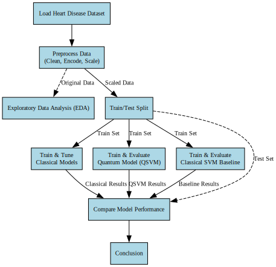
    <figcaption>Figure 1: Workflow Sequence.</figcaption>
</figure>

**3.1. Data Acquisition and Preprocessing**

*   **Data Loading:** The dataset, `Heart Prediction Quantum Dataset.csv`, containing 500 samples and 7 features, was loaded into a pandas DataFrame.
*   **Initial Checks:** The dataset was inspected for missing values (none found) and duplicate rows (none found) using pandas functionalities. Data types were reviewed (`df.info()`).
*   **Feature Encoding:** The 'Gender' feature was ensured to be in a numerical format (0 for Female, 1 for Male, as inferred from the dataset values). All other predictor features were already numeric or converted, with any potential errors during conversion imputed using the mean of the respective column. The final feature set included 'Age', 'Gender', 'BloodPressure', 'Cholesterol', 'HeartRate', and 'QuantumPatternFeature'. The binary target variable was 'HeartDisease'.
*   **Feature Scaling:** To ensure compatibility with distance-based and kernel-based algorithms (SVM, QSVM, KNN) and to prevent features with larger ranges from dominating, all predictor features were scaled to the range \[0, 1] using `sklearn.preprocessing.MinMaxScaler`.
*   **Data Splitting:** The scaled dataset was partitioned into training (80% of data) and testing (20% of data) sets using `sklearn.model_selection.train_test_split`. Stratification based on the 'HeartDisease' target variable was applied to maintain the original class distribution in both training and testing subsets. A fixed `random_state` (42) was used for reproducibility.

<figure>
    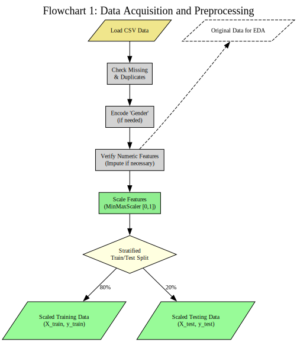
    <figcaption>Figure 2: Data acquisation and preprocessing.</figcaption>
</figure>

**3.3. Exploratory Data Analysis (EDA)**

Prior to model training, EDA was conducted on the original (unscaled, but numerically encoded) dataset to gain insights into data characteristics and potential relationships. Seaborn and Matplotlib were used to generate:
*   **Histograms:** To visualize the distribution of continuous numerical features ('Age', 'BloodPressure', 'Cholesterol', 'HeartRate') (See Figures 1a-1d in Results).
*   **Boxplots:** To identify the central tendency, spread, and potential outliers for the same numerical features (Figure 2).
*   **Correlation Heatmap:** To quantify and visualize the linear relationships between all numerical features, including the target variable (Figure 3).
*   **Violin Plots:** To compare the distributions of key clinical indicators ('BloodPressure', 'Cholesterol') across the two 'HeartDisease' classes (Figures 4a-4b).
*   **KDE Plots:** To visualize the probability density of 'HeartRate' conditioned on the 'HeartDisease' outcome (Figure 5).
*   **Scatter Plots:** To explore potential relationships and class separability between the 'QuantumPatternFeature' and 'BloodPressure'/'Cholesterol' (Figures 6a-6b).

**3.3. Classical Machine Learning Models**

*   **Model Selection:** Six standard classical classification algorithms from scikit-learn were chosen for comparison: Logistic Regression, K-Nearest Neighbors (KNN), Decision Tree, Random Forest, Gaussian Naive Bayes, and Gradient Boosting Classifier.
*   **Hyperparameter Tuning:** `RandomizedSearchCV` was employed to optimize hyperparameters for each classical model. A predefined parameter grid was specified for each algorithm (details omitted for brevity, refer to code appendix). The search performed 20 iterations (`n_iter=20`) using 5-fold cross-validation (`cv=5`) on the scaled training data, aiming to maximize the 'accuracy' score.
*   **Training and Evaluation:** The best estimator identified by `RandomizedSearchCV` for each model type was subsequently trained on the entire scaled training set. Predictions were made on the unseen scaled test set. Performance was evaluated using accuracy score, a detailed classification report (precision, recall, F1-score per class), and a confusion matrix heatmap.

<figure>
    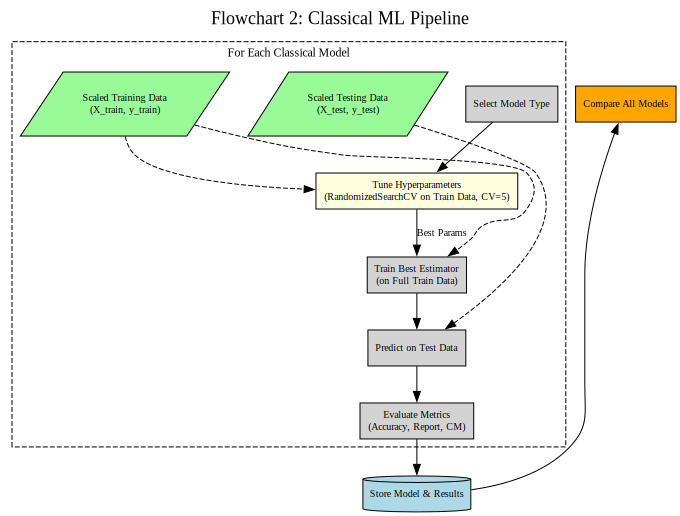
    <figcaption>Figure 3: Classical ML pipeline.</figcaption>
</figure>

**3.4. Quantum Machine Learning Model (QSVM))**

*   **Framework:** The QSVC was implemented using Qiskit v1.1.1 and its associated libraries (`qiskit-machine-learning`, `qiskit-algorithms`).
*   **Feature Map:** Classical data points from the scaled training/testing sets were encoded into quantum states using the `qiskit.circuit.library.ZZFeatureMap`. The dimension was set to match the number of input features (6), with `reps=2` and `entanglement='linear'`. (See Diagram 2a for ZZFeatureMap structure illustration).
*   **Quantum Kernel:** The similarity between encoded quantum states was computed using the `qiskit_machine_learning.kernels.FidelityQuantumKernel`. This kernel utilizes the `qiskit_algorithms.state_fidelities.ComputeUncompute` method to calculate state fidelity (overlap). The underlying computations were performed using the `qiskit.primitives.Sampler` running on a local classical statevector simulator.
*   **QSVC Classifier:** The `qiskit_machine_learning.algorithms.QSVC` classifier was instantiated using the defined `FidelityQuantumKernel`.
*   **Training and Evaluation:** The QSVC was trained on the scaled training data (`X_train`, `y_train`). Predictions were made on the scaled test data (`X_test`). Performance was evaluated using the same metrics as the classical models. Training and prediction times were recorded.

<figure>
    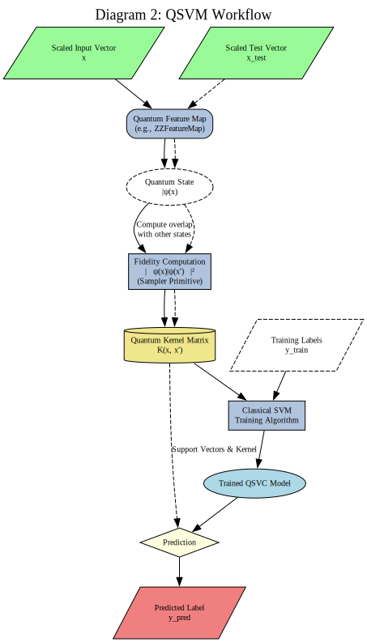
    <figcaption>Figure 4: QSVM Workflow.</figcaption>
</figure>

**3.5. Classical SVM Baseline**

*   To provide a direct classical analogue to the QSVC, a standard `sklearn.svm.SVC` was implemented.
*   An RBF kernel (`kernel='rbf'`) was used with default parameters (`gamma='scale'`, `C=1.0`).
*   The SVC was trained and evaluated on the *exact same* scaled training and testing data used for the QSVM. Performance metrics and timing were recorded.

**3.6. Model Comparison and Tools**

*   The primary metric for comparison was the accuracy score achieved on the hold-out test set. Classification reports and confusion matrices were used for more detailed performance insights per class.
*   Execution times for training and prediction were noted, particularly for comparing the QSVM simulator against classical methods.
*   Visual comparison of accuracies was facilitated using a bar chart.
*   All implementations and analyses were performed in Python 3 using libraries including pandas, numpy, scikit-learn, Qiskit (and related packages), matplotlib, and seaborn.

---

**3. Exploratory Data Analysis (EDA)**

Prior to developing predictive models, a thorough Exploratory Data Analysis (EDA) was conducted on the "Heart Prediction Quantum Dataset" to understand its underlying characteristics, feature distributions, inter-feature relationships, and potential correlations with the target variable, 'HeartDisease'. This analysis utilized descriptive statistics and various visualization techniques implemented with the pandas, seaborn, and matplotlib libraries.

**3.1. Descriptive Statistics and Initial Overview**

The dataset comprises 500 samples and 7 features. Initial checks confirmed the dataset's integrity, revealing no missing values or duplicate entries. The features include 'Age', 'Gender' (encoded numerically as 0/1), 'BloodPressure', 'Cholesterol', 'HeartRate', 'QuantumPatternFeature' (float), and the binary target 'HeartDisease' (0: No Disease, 1: Disease).

Descriptive statistics revealed the following ranges and central tendencies for the key numerical features:
*   **Age:** Ranged from 30 to 79 years, with a mean of approximately 54.9 years.
*   **Blood Pressure:** Ranged from 90 to 179 mmHg, with a mean of approximately 132.9 mmHg.
*   **Cholesterol:** Ranged from 150 to 299 mg/dL, with a mean of 221.5 mg/dL.
*   **Heart Rate:** Ranged from 60 to 119 bpm, with a mean of approximately 88.8 bpm.
*   **QuantumPatternFeature:** Varied between approximately 6.16 and 10.78, with a mean of 8.32.

The target variable 'HeartDisease' showed a moderate class imbalance, with 60% of the samples belonging to Class 1 (Disease) and 40% to Class 0 (No Disease).

**3.2. Univariate Analysis: Feature Distributions**

Histograms were generated to visualize the distributions of the primary numerical features ('Age', 'BloodPressure', 'Cholesterol', 'HeartRate'), augmented with Kernel Density Estimates (KDE) (Figures 5a-5d).
*   'Age' displayed a relatively wide and somewhat uniform distribution across the adult range included in the dataset.
*   'BloodPressure', 'Cholesterol', and 'HeartRate' distributions appeared roughly unimodal, exhibiting varying degrees of spread, visually suggesting near-normal or slightly skewed patterns typical of clinical measurements.

<figure>
    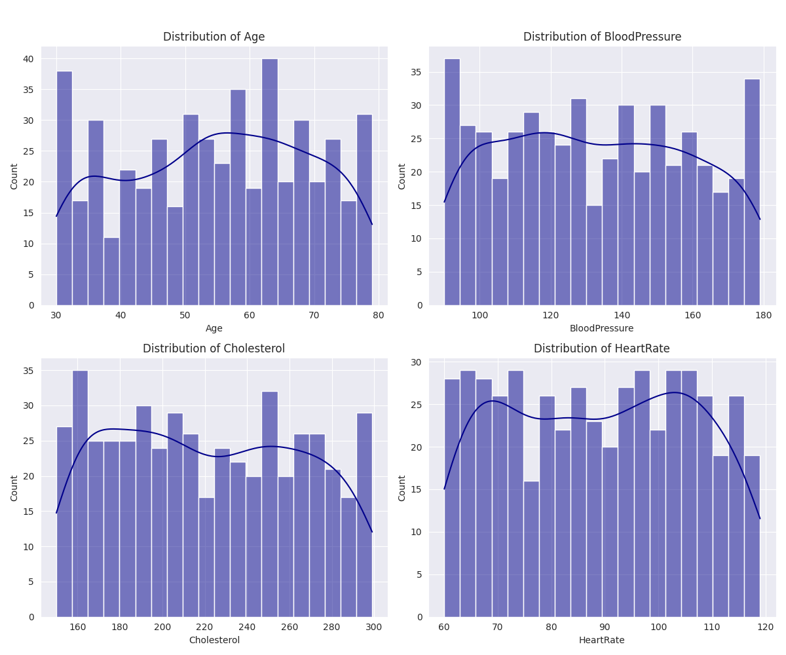
    <figcaption>Figure 5: Histogram and distributions of numerical features.</figcaption>
</figure>

Boxplots provided a complementary view of these distributions, summarizing central tendency, dispersion, and identifying potential outliers (Figure 6). While most data points fell within typical ranges, the boxplots allowed for a quick assessment of the interquartile range (IQR) and overall feature spread.

<figure>
    
    <figcaption>Figure 6: Boxplot of numerical features.</figcaption>
</figure>

**3.3. Bivariate and Multivariate Analysis**

**3.3.1. Correlation Analysis**
A correlation heatmap (Figure 7) was generated to assess linear relationships between all numerical features. Key observations include:

<figure>
    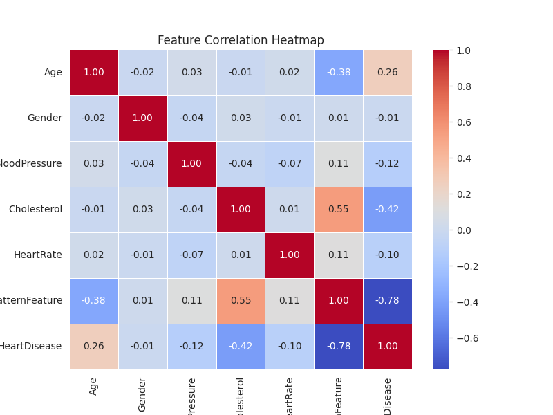
    <figcaption>Figure 7: Feature corelation heatmap.</figcaption>
</figure>

*   **QuantumPatternFeature vs. HeartDisease:** A strong negative correlation (-0.78) was observed, suggesting that lower values of this feature are linearly associated with the presence of heart disease (Class 1). This is the most prominent linear relationship with the target variable.
*   **Cholesterol vs. HeartDisease:** A moderate negative correlation (-0.42) was found, indicating a tendency for lower cholesterol levels to be associated with Class 1 in this dataset.
*   **Age vs. HeartDisease:** A weaker positive correlation (0.26) suggested a slight tendency for older age to be associated with Class 1.
*   **Other Clinical Features:** 'Gender', 'BloodPressure', and 'HeartRate' showed very weak linear correlations with 'HeartDisease'.
*   **Inter-Feature Correlations:** A notable moderate positive correlation (0.55) was observed between 'QuantumPatternFeature' and 'Cholesterol'.

**3.3.2. Feature Distributions by Target Class**
To explore differences beyond linear correlation, feature distributions were examined conditioned on the 'HeartDisease' status:
*   **Violin Plots (Figures 8a-8b):** These plots compared the distributions of 'BloodPressure' and 'Cholesterol' between the 'No Disease' (0) and 'Disease' (1) classes. While visual differences in the shape and median of the distributions were apparent (e.g., seemingly lower cholesterol tendency in Class 1, consistent with correlation), significant overlap between the classes was evident for both features.

<figure>
    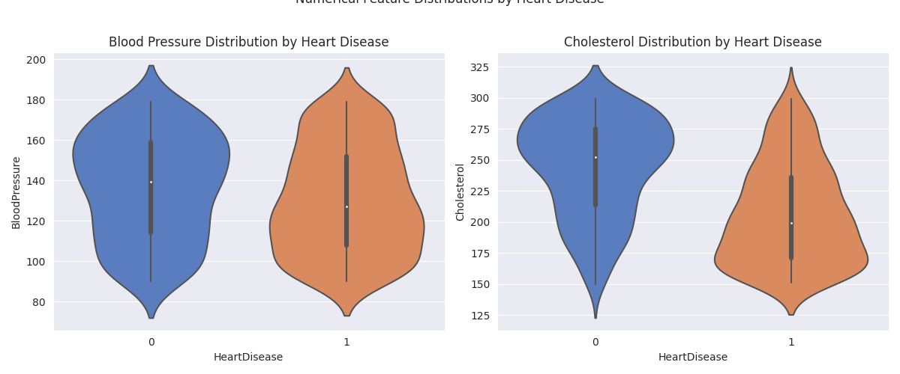
    <figcaption>Figure 8: Numerical Feature distribution by heart disease.</figcaption>
</figure>

*   **KDE Plot:** The density plot for 'HeartRate' in Figure 9 stratified by 'HeartDisease' highlighted subtle differences in the distribution shapes, although the overall ranges and central tendencies largely overlapped, indicating limited discriminatory power for 'HeartRate' alone.

<figure>
    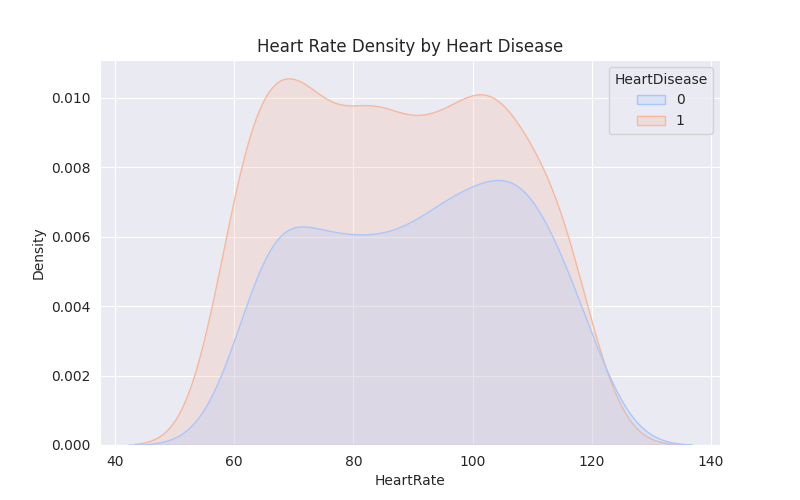
    <figcaption>Figure 9: Heart rate density by heart disease.</figcaption>
</figure>

**3.3.3. QuantumPatternFeature Analysis**
Given the unique nature and strong correlation of the 'QuantumPatternFeature', its relationship with other clinical variables and the target class was further investigated:
*   **Scatter Plots (Figures 10a-10b):** Plots of 'QuantumPatternFeature' against 'BloodPressure' and 'Cholesterol', colored by 'HeartDisease' status, were generated. These plots visually corroborated the correlations observed in the heatmap. While no perfect linear or non-linear boundary clearly separated the classes, the plots indicated some clustering tendencies, particularly reinforcing the association of lower 'QuantumPatternFeature' values with the 'Disease' class (Class 1).

<figure>
    
    <figcaption>Figure 10: Quantunm pattern feature vs Clinical indicators.</figcaption>
</figure>

**3.4. Summary of EDA Findings**

The EDA revealed a clean dataset with a moderate class imbalance. The 'QuantumPatternFeature' emerged as the most strongly (linearly) correlated predictor with 'HeartDisease', exhibiting a negative relationship. 'Cholesterol' and 'Age' showed moderate correlations. Other standard clinical features ('Gender', 'BloodPressure', 'HeartRate') displayed weak linear associations with the target. While visualizations comparing distributions across classes showed some differences, significant overlap suggested that predicting heart disease from these features is a non-trivial task likely requiring sophisticated modeling approaches. The strong correlation involving the 'QuantumPatternFeature' highlighted its potential significance as a predictor, warranting its inclusion in subsequent classical and quantum modeling steps.

---

**4. Results**

This section presents the findings from the performance evaluation of the classical and quantum machine learning models on the test set (100 samples), following the EDA which highlighted the 'QuantumPatternFeature's' strong correlation with the target.

**4.1. Classical Model Performance**

After hyperparameter optimization using `RandomizedSearchCV`, the six classical ML models were evaluated. Their performance metrics are summarized in Table 1.

| Model                        | Test Accuracy | Weighted Avg Precision | Weighted Avg Recall | Weighted Avg F1-Score | Tuning+Eval Time (s) |
| :--------------------------- | :------------ | :--------------------- | :------------------ | :-------------------- | :------------------- |
| **Logistic Regression**      | **0.9300**    | 0.93                   | 0.93                | 0.93                  | 2.61                 |
| **Gradient Boosting**        | **0.9300**    | 0.93                   | 0.93                | 0.93                  | 6.17                 |
| Random Forest                | 0.9200        | 0.92                   | 0.92                | 0.92                  | 6.89                 |
| Naive Bayes                  | 0.9100        | 0.91                   | 0.91                | 0.91                  | 0.31                 |
| Decision Tree                | 0.8700        | 0.87                   | 0.87                | 0.87                  | 0.43                 |
| K-Nearest Neighbors          | 0.8300        | 0.83                   | 0.83                | 0.83                  | 0.57                 |

**Table 1: Classical Model Test Set Performance Summary**

*   **Top Performers:** Tuned Logistic Regression and Gradient Boosting classifiers achieved the highest accuracy at 93.0%. Their confusion matrices (**Figure 11a** for Logistic Regression, **Figure 11b** for Gradient Boosting) confirm their strong performance, each making only 7 errors. Logistic Regression misclassified 4 'No Disease' samples as 'Disease' (FP) and 3 'Disease' samples as 'No Disease' (FN). Gradient Boosting made 3 FP and 4 FN errors. Both models demonstrated balanced performance across classes according to their detailed classification reports.
*   **Random Forest:** Achieved 92.0% accuracy. Its confusion matrix (**Figure 11c**) shows 8 errors: only 2 FP but 6 FN, indicating a slight tendency to miss actual heart disease cases compared to the top two models.
*   **Naive Bayes:** Reached 91.0% accuracy. The confusion matrix (**Figure 11d**) reveals 9 misclassifications (4 FP, 5 FN), a reasonably balanced error profile.
*   **Decision Tree:** Resulted in 87.0% accuracy. It made more errors (13 total), with 6 FP and 7 FN (**Figure 11e**).
*   **K-Nearest Neighbors:** Had the lowest accuracy among the classical models at 83.0%. Its confusion matrix (**Figure 7f**) shows 17 errors, with a higher number of False Positives (10 FP) compared to False Negatives (7 FN).
*   **Computational Time:** Tuning and evaluation times remained low for classical methods (Table 1), highlighting their efficiency.

|  *Figure 11 (a): Logistic Regression* | 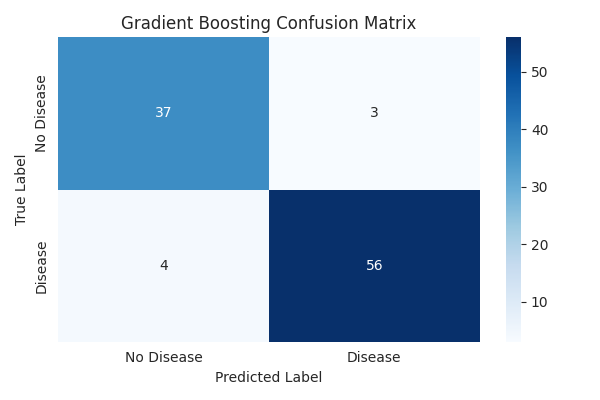 *Figure 11 (b): Gradient Boosting* | 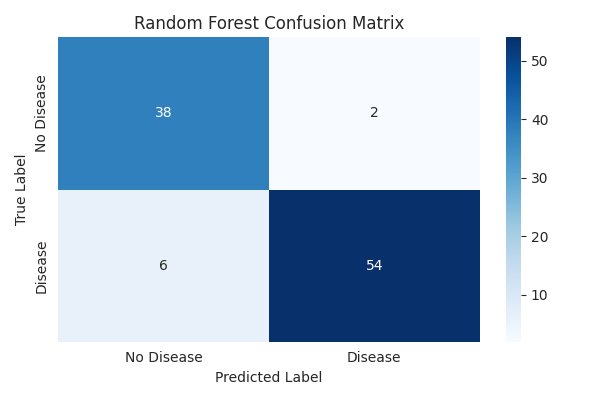 *Figure 11 (c): Random Forest* |
|---------------------------------------------|---------------------------------------------|---------------------------------------------|
| 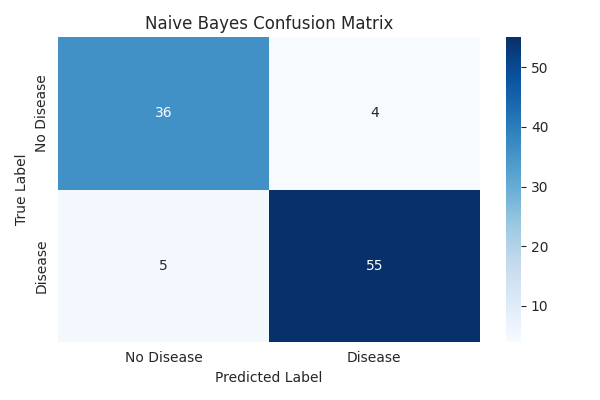 *Figure 11 (d): Naive Bayes* |  *Figure 11 (e): Decision Tree* | 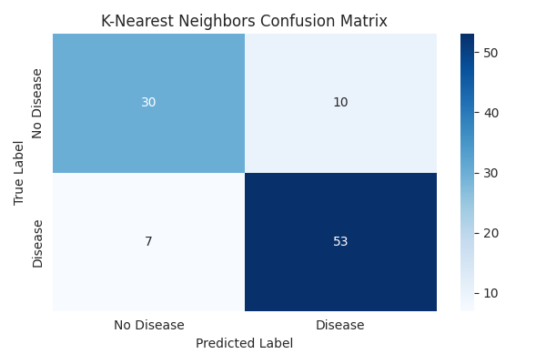 *Figure 11 (f): K-Nearest Neighbors* |

**4.2. Quantum SVM (QSVC) Performance**

The QSVC, evaluated on the classical simulator, yielded the following results:
*   **Accuracy:** **0.7900**.
*   **Detailed Metrics:** Weighted average F1-score was 0.79. Class 1 (Disease) prediction was better (F1=0.83) than Class 0 (No Disease) (F1=0.72).
*   **Confusion Matrix:** The confusion matrix (**Figure 7g**) shows 79 correct predictions (27 TN, 52 TP). There were 21 misclassifications: 8 False Positives and 13 False Negatives. The higher number of False Negatives indicates the QSVM struggled more significantly with correctly identifying 'No Disease' cases compared to its ability to identify 'Disease' cases.
*   **Computational Time:** Training took approximately 703 seconds, and prediction took approximately 358 seconds on the simulator.

*(Placement for Figure 7g: Insert the QSVC confusion matrix heatmap image here.)*

**4.3. Classical SVM (RBF Kernel) Baseline Performance**

The standard SVC with an RBF kernel provided a direct classical comparison point:
*   **Accuracy:** **0.8900**.
*   **Detailed Metrics:** Weighted average F1-score was 0.89. High recall (0.97) for Class 1 was achieved at the cost of lower recall (0.78) for Class 0.
*   **Confusion Matrix:** The confusion matrix (**Figure 7h**) displayed 89 correct predictions (31 TN, 58 TP) and only 11 errors (9 FP, 2 FN). Notably, it had very few False Negatives.
*   **Computational Time:** Training (0.01s) and prediction (0.00s) were extremely fast.

*(Placement for Figure 7h: Insert the Classical SVC (RBF) confusion matrix heatmap image here.)*

**4.4. Overall Model Comparison**

The comparison bar chart (Figure 8) visually summarizes the test accuracies, clearly ranking the models.

<figure>
    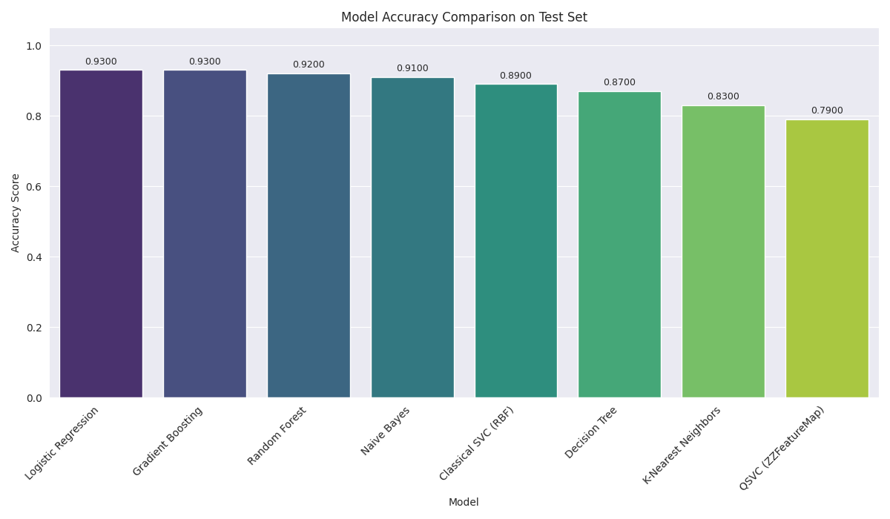
    <figcaption>Figure 12: Model accuracy comparison on test set.</figcaption>
</figure>

The top classical models (Logistic Regression, Gradient Boosting) achieved 93% accuracy, substantially higher than the QSVC's 79%. The classical SVC baseline (89%) also significantly outperformed the QSVM. An analysis of the confusion matrices (Figures 7a-7h) confirms these findings, showing the QSVM made considerably more errors (21) than the top classical models (7) and the SVC baseline (11), particularly struggling with False Negatives (misclassifying 'Disease' as 'No Disease'). The computational overhead of the simulated QSVM further contrasts with the efficiency of the classical methods.

---

**5. Discussion**

This study provides a comparative evaluation of classical machine learning models and a Quantum Support Vector Machine (QSVM) approach, executed on a classical simulator, for the task of heart disease prediction using a dataset featuring both standard clinical variables and a 'QuantumPatternFeature'. The results highlight several key points regarding the relative performance and practicality of these methods on this specific dataset.

**5.1. Dominance of Classical Models**

The most striking observation is the superior performance of the tuned classical machine learning models compared to the implemented QSVM. Logistic Regression and Gradient Boosting, after hyperparameter optimization via RandomizedSearchCV, achieved the highest test accuracy (93.0%). Several other classical models, including Random Forest (92.0%), Naive Bayes (91.0%), and the baseline classical SVC with an RBF kernel (89.0%), also significantly outperformed the QSVM, which achieved an accuracy of 79.0%. This suggests that the underlying patterns within this dataset, despite the presence of the 'QuantumPatternFeature', are effectively captured by well-established classical algorithms, particularly when their hyperparameters are appropriately tuned. The strong performance of relatively simpler models like Logistic Regression is also noteworthy, indicating that complex non-linear interactions might not be the dominant factor for classification in this specific data representation.

**5.2. QSVM Performance and Computational Cost**

The relatively lower accuracy of the QSVM (79.0%) compared to its classical counterparts, including the baseline RBF SVC (89.0%), indicates that the chosen quantum kernel approach (ZZFeatureMap with FidelityQuantumKernel) did not offer a performance advantage on this dataset when executed via simulation. While the 'QuantumPatternFeature' exhibited the strongest linear correlation with the target variable during EDA, this did not translate into superior performance for the QSVM in this configuration. This could be due to several factors:
1.  **Feature Map/Kernel Suitability:** The ZZFeatureMap, while a common choice, might not be the optimal way to encode this specific dataset's features into quantum states to reveal a classification advantage detectable via the fidelity kernel. Quantum kernel design is crucial and problem-dependent.
2.  **Simulation Limitations:** The QSVM was run on a classical simulator. Simulating quantum states is exponentially resource-intensive, which explains the drastically longer training (≈703s) and prediction (≈358s) times compared to classical models (often <10s). Furthermore, simulators do not capture the noise inherent in current real quantum hardware, which could further impact performance.
3.  **Dataset Characteristics:** The dataset size (500 samples) might be insufficient for the QSVM to learn complex, high-dimensional patterns where quantum advantage is often hypothesized. Classical models often perform well on smaller, tabular datasets.
4.  **No Inherent Quantum Advantage:** It is possible that the data structure, even with the 'QuantumPatternFeature', does not possess the specific type of complexity that current quantum kernel methods are well-suited to exploit more effectively than classical methods.

The extreme computational cost associated with simulating the quantum kernel makes the current QSVM approach impractical for real-time or large-scale application compared to the highly efficient classical alternatives.

**5.3. Role of the 'QuantumPatternFeature'**

Despite its strong correlation with 'HeartDisease' (-0.78), the 'QuantumPatternFeature' did not lead to a QML advantage in our QSVM implementation. It functioned effectively as a standard numerical feature within the classical models, contributing to their high performance. The lack of information regarding the feature's origin or quantum encoding makes it challenging to design a QML strategy that specifically leverages its potential quantum nature beyond treating it as a classical value.

**5.4. Limitations**

This study has several limitations:
*   The dataset size is relatively small (500 samples), which may limit the generalizability of the findings and potentially hinder the performance of complex models like QSVM.
*   The 'QuantumPatternFeature' lacks clear documentation regarding its derivation, limiting our ability to tailor specific quantum approaches to it.
*   The QSVM implementation used a specific feature map and kernel; other QML approaches (different kernels, feature maps, or algorithms like VQC) might yield different results.
*   The QSVM was evaluated using classical simulation, which is slow and does not reflect the noise characteristics of current quantum hardware.
*   Hyperparameter tuning was performed for classical models but not extensively for the QSVM due to computational constraints.

**5.5. Implications and Future Work**

The results strongly suggest that for this specific dataset and prediction task, optimized classical machine learning algorithms are currently the more practical and higher-performing choice compared to the simulated QSVM approach tested. The inclusion of a feature labeled "quantum" does not guarantee an advantage when applying QML techniques, especially standard ones on simulators.

Future work could explore several directions:
1.  Investigating the nature and origin of the 'QuantumPatternFeature' to potentially inform the design of more tailored quantum algorithms.
2.  Experimenting with alternative quantum feature maps (e.g., PauliFeatureMap) and different quantum kernel estimation techniques within the QSVM framework.
3.  Exploring other QML algorithms, such as Variational Quantum Classifiers (VQCs), which might be better suited for near-term hardware.
4.  Performing rigorous hyperparameter tuning for the QSVM, potentially using more efficient optimization strategies suitable for expensive function evaluations.
5.  Evaluating the QSVM on actual quantum hardware to understand the impact of noise and compare performance against simulation and classical methods in a real-world quantum context (acknowledging hardware limitations).
6.  Applying the tested methodologies to larger and potentially more complex datasets where quantum advantages might be more likely to emerge.

In conclusion, while QML holds theoretical promise, this study demonstrates that careful empirical comparison against optimized classical baselines is crucial. On the analyzed dataset, classical methods provided a more effective and efficient solution than the simulated QSVM implementation.

---

**6. Conclusion**

This study conducted a comparative analysis of classical machine learning algorithms and a Quantum Support Vector Machine (QSVM) for the prediction of heart disease, utilizing a dataset containing standard clinical features and a unique 'QuantumPatternFeature'.

Our findings demonstrate that well-established classical machine learning models, particularly Logistic Regression and Gradient Boosting (both achieving 93.0% test accuracy) after hyperparameter tuning, significantly outperformed the simulated QSVM (79.0% accuracy) on this specific dataset. A baseline classical SVC with an RBF kernel also surpassed the QSVM, achieving 89.0% accuracy. The classical models proved not only more accurate but also substantially more computationally efficient, with training and prediction times measured in seconds compared to minutes or hours for the simulated QSVM.

While the 'QuantumPatternFeature' showed a strong correlation with the target variable and contributed positively to the performance of classical models, its inclusion did not confer an advantage to the QSVM implementation tested here (ZZFeatureMap with FidelityQuantumKernel on a simulator). This suggests that either the chosen QML approach was not optimal for leveraging this feature's potential characteristics, or the dataset's structure and size are better suited for classical techniques.

In conclusion, for the specific task and dataset analyzed, optimized classical machine learning methods provide a more practical and effective solution for heart disease prediction than the simulated QSVM approach. This underscores the importance of rigorous benchmarking against classical methods when evaluating potential QML applications, especially in the near term and when relying on simulation. While QML remains a promising field, demonstrating a practical advantage requires careful consideration of dataset characteristics, algorithm suitability, computational resources, and potentially the use of actual quantum hardware. Future research could benefit from exploring alternative QML models, different feature encoding strategies, and evaluations on larger datasets or real quantum devices.

---
